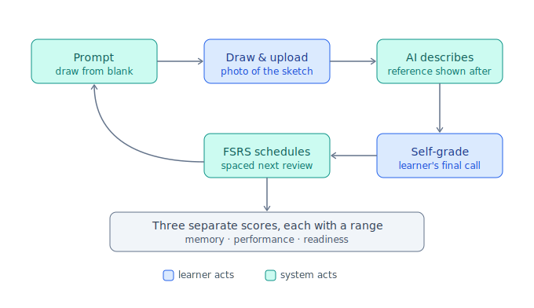

# w2--graphite — AWS SAA-C03 Speedrun (an Anki fork)

> **This repository is a fork of [Anki](https://github.com/ankitects/anki) (`ankitects/anki`), licensed AGPL-3.0-or-later.** All Anki source, design, and trademarks belong to Ankitects Pty Ltd and the Anki contributors. Upstream's original README and build instructions are preserved in [`README.Anki.md`](README.Anki.md); the license is in [`LICENSE`](LICENSE).

**Exam:** AWS Certified Solutions Architect – Associate (**SAA-C03**).

Week-2 **Speedrun** project: a desktop + mobile study app built on the Anki engine for one exam. The headline study feature is a **hand-drawn architecture-diagram flashcard** — the learner draws an AWS architecture from a blank prompt, uploads a photo, a multimodal AI describes and checks it against a reference shown *only after* the attempt, and the **learner makes the final self-grade**. The app measures three *separate* things — **memory**, **performance**, and **readiness** — each with an honest uncertainty range, and refuses to show a number it can't back up.

## Project docs (added on top of the Anki fork)

| Path | What |
|---|---|
| [`BrainLift.md`](BrainLift.md) | The research-backed BrainLift: purpose, 7 spiky points of view, experts, insights, a sourced knowledge tree, and an honest viability verdict + falsifiable ablation hypothesis. |
| [`memory/`](memory/) | The project's context/memory system ([index](memory/MEMORY.md), [project](memory/speedrun-project.md), [key risks](memory/brainlift-saa-key-risks.md)). |
| [`assets/`](assets/) | Figures. |
| [`README.Anki.md`](README.Anki.md) | Anki's original README — source-build instructions for desktop, the Rust engine, and the toolchain. |

## The Anki engine

This repo forks Anki's source so the desktop app, the phone companion, and the planned engine change all share the same Rust core (not a rewrite). Build instructions live in [`README.Anki.md`](README.Anki.md) and `docs/`. Upstream: [`ankitects/anki`](https://github.com/ankitects/anki) — kept as the `upstream` remote so future merges stay clean.

## Status

- ✅ Research, BrainLift, and viability verdict.
- ✅ Anki forked in (full history, `upstream` tracked).
- ⏳ The Rust engine change, the two-stage AI diagram judge, and the three-score honesty layer — built here next.

## Verdict (from the BrainLift)

Build it — as a tool for **measuring and calibrating skill honestly**, not as a tool that promises to raise the SAA-C03 score faster than plain Anki. The exam is 100% multiple-choice, so the open question — does drawing transfer, and is it worth the per-minute cost? — gets settled by the equal-time ablation, not by assertion.

## License

**AGPL-3.0-or-later**, inherited from Anki, with credit to [Anki](https://github.com/ankitects/anki) (`ankitects/anki`). Some Anki components are BSD-3-Clause; see [`LICENSE`](LICENSE) and the upstream tree for details.
